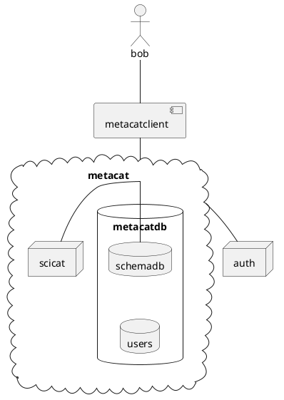

Run the server in a docker container. See server/README

Run the client. See the client README




```plantuml
Bob -> metcat : write_metadata
metcat->metcat : user/schema auth?
metcat-x Bob : failure
metcat->metcat : metadata/schema valid?
metcat-x Bob : failure
metcat->scicat : upload_new_dataset
scicat->metcat : dataset_id
metcat->Bob : dataset_id
```

```plantuml
start
partition client{
:receive data;
:Assemble metadata;
:Write metadata;
}
partition metacat {
if (user / schema allowed) then (yes)

 if( metadata / schema valid) then (yes)
 :scicat write;
 else (no)
 stop
 endif
 
else (no)
stop
endif
}

partition scicat{
:upload_dataset;
}

stop

```
