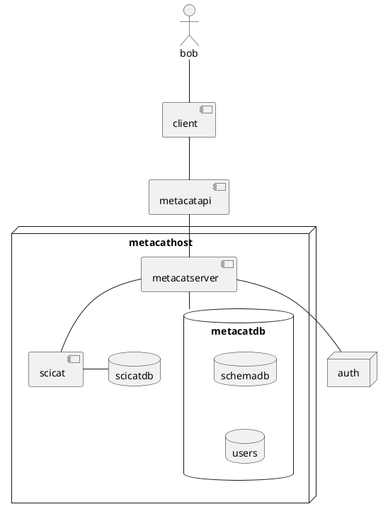

Start the keycloak container
`docker-compose -f keycloak-compose.yaml`up -d

Create realm a realm eg realm1

Create a client (eg metacat-test) in realm1. Remember the client secret. Create a role 'admin'

Create a user 'test'. Set the password to 'test'. Set the email as verified. In role mapping assing a role (metacat-test admin).
Enable authentication and Authorization


Create serverclient_secrets.json
Replace client secret with that remembered from keycloak
Replace MACHINE_NAME with the local machine name (ensure '.local' suffix)
`
{
    "web": {
        "client_id": "metacat-test",
        "client_secret": "<CLIENT SECRET>",
        "auth_uri": "http://MACHINE_NAME:8180/realms/realm1/protocol/openid-connect/auth",
        "token_uri": "http://MACHINE_NAME:8180/realms/realm1/protocol/openid-connect/token",
        "token_introspection_uri": "http://MACHINE_NAME:8180/realms/realm1/protocol/openid-connect/token/introspect",
        "userinfo_uri": "http://MACHINE_NAME:8180/realms/realm1/protocol/openid-connect/userinfo",
        "issuer": "http://MACHINE_NAME:8180/realms/realm1",
        "redirest_uris": ["http://127.0.0.1:5000/*", "http://metacat:5000/*"],
        "response type" : "code",
        "scope":"openid profile email"
    }
}
`


Create client/oidc_config.env
Replace MACHINE_NAME
`
CLIENT_ID=metacat-test
CLIENT_SECRET=<CLIENT SECRET>
TOKEN_URL=http://MACHINE_NAME:8180/realms/realm1/protocol/openid-connect/token
CLIENT_USER=test
CLIENT_PASSWORD=test
`


Run the server in a docker container. See server/README

Run the client. See the client README




```plantuml
Bob -> metcat : write_metadata
metcat->metcat : user/schema auth?
metcat-x Bob : failure
metcat->metcat : metadata/schema valid?
metcat-x Bob : failure
metcat->scicat : upload_new_dataset
scicat->metcat : dataset_id
metcat->Bob : dataset_id
```

```plantuml
start
partition client{
:receive data;
:Assemble metadata;
:Write metadata;
}
partition metacat {
if (user / schema allowed) then (yes)

 if( metadata / schema valid) then (yes)
 :scicat write;
 else (no)
 stop
 endif
 
else (no)
stop
endif
}

partition scicat{
:upload_dataset;
}

stop

```
